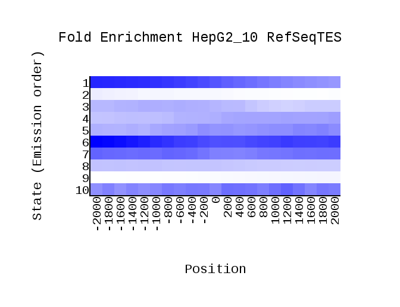
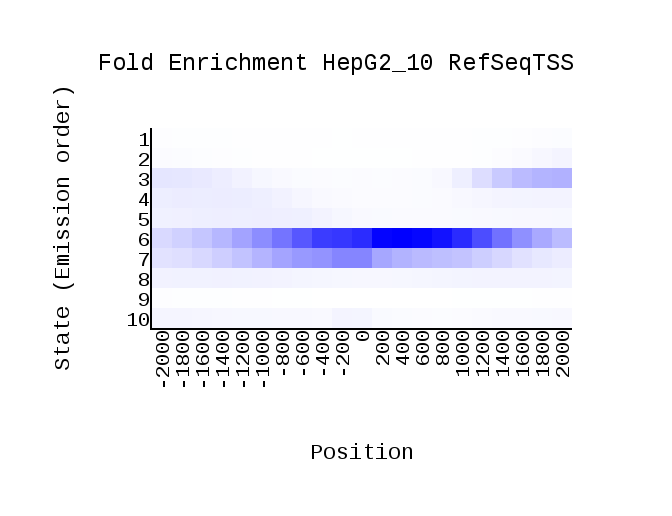
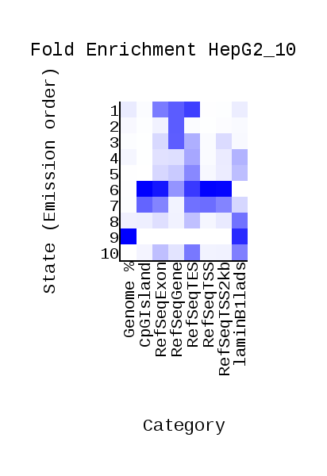
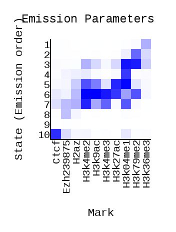
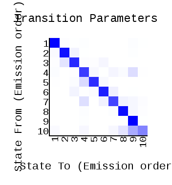

# hse_hw3_chromhmm

## [Google Colab](https://colab.research.google.com/drive/1KsgIrD3Rdr47IQiBGiGNU5J3NEbHM8pG?usp=sharing)

## Table of histone labels and corresponding files

Like in previous hometask, a HepG2 cell line was taken.

| histone label | filename |
|---|---|
| Ctcf | HepG2_Ctcf.bam |
| Ezh239875 | HepG2_Ezh.bam |
| H2az | HepG2_H2az.bam |
| H3k04me1 | HepG2_H3k04me1.bam |
| H3k4me2 | HepG2_H3k4me2.bam |
| H3k4me3 | HepG2_H3k4me3.bam |
| H3k9ac | HepG2_H3k9ac.bam |
| H3k27ac | HepG2_H3k27ac.bam |
| H3k36me3 | HepG2_H3k36me3.bam |
| H3k79me2 | HepG2_H3k79me2.bam |

## Pictures from ChromHmm LearnModel output

